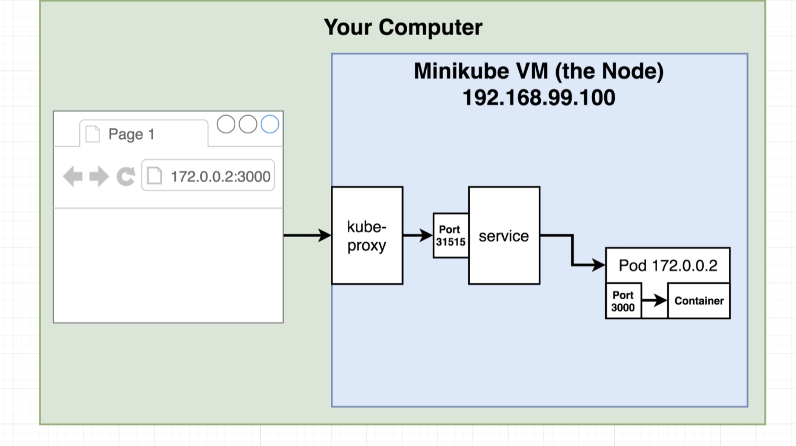

# Class 1 - Kubernetes Workshop

## What is Kubernetes?

System for running many different containers over multiple different machines

## Why use Kubernetes?
When you need to run many different containers with different images

## Development

- minikube (Command Line Tool) Used for managing the VM itself (LOCAL ONLY)
- kubectl Used for managing containers in the node

1. Install Kubectl
2. Install a VM driver virtualbox
3. Install minikube (brew install minikube)

```bash
minikube status
kubectl cluster-info
```

## Production

Managed solutions:
- Amazon Elastic Container Service for Kubernetes (EKS)
- Google Cloud Kubernetes Engine (GKE)

Config files in kubernetes are used to create objects. Install

Object Types:
- StatefulSet
- ReplicaController
- Pod
- Service (ClusterIp, NodePort, LoadBalancer, Ingress)

Pod -> Runs one or more closely related containers
Services -> Sets up networking in a Kubernetes Cluster

## Important Takeaways

- Kubernetes is a system to deploy containerized apps
- **Nodes** are individual machines (or vm's) that run containers
- **Masters** are machines (or vm's) with a set of programs to manage nodes
- Kubernetes didn't build our images - it got them from somewhere else
- Kubernetes (the master) decided where to run each container - each node can run a dissimilar set of containers
- To deploy something, we update the desired state of the master with a config file
- The master works constantly to meet your desired state

## Imperative Approach

- Create 3 containers using the multi-worker image
- Make another 2 containers with multi-worker
- Delete 1 container running multi-worker
- Those X number of containers should be networked to multi-redis
- Those X number of containers should be updated to use multi-redis v1.23

## Declarative Approach

- There should be 3 containers using the multi-worker
- There should be 5 containers using multi-worker
- There should be 4 containers using multi-worker
- There should be 4 containers using multi-worker networked to multi-redis

## Inspecting the cluster

```bash
kubectl describe <object-type> <object-name>
```

## Object Types
- Pods: Runs one or more closely related containers
- Services: Sets up networking in a Kubernetes Cluster
- Deployments: Maintains a set of identical pods, ensuring that they have the correct configuration and that the right number exists.

## Pods vs Deployments

Pods runs a single set of containers | Deployments runs a set of identical pods (one or more)

Pods good for one-off dev purposes | Deployments good for long-term production

Pods are rarely use directly in production | Deployments monitors the state of each pod, updating as necessary

Deployments are the most common object type and have attached a pod template

## Remove an object

```bash
kubectl delete -f <config file>
```

## Get Pod details

```bash
kubectl get pods -o wide
```



## Update Image Version

- Change deployment to use multi-client again
- Update the multi-client image, push to Docker Hub
- Get the deployment to recreate our pods with the latest version of multi-client (1. Manually delete pods to get the deployment to recreate them) with the latest version or 2. Tag built images with a real version number and specify that version in the config file or 3. Use an imperative command to update the image version that the deployment should use)

## Imperative command (ugh) to update image

```bash
kubectl set image <object_type>/<object_name> <container_name>=<new-image-to-use>

kubectl set image deployment/client-deployment client=stephengrider/multi-client:v5
```